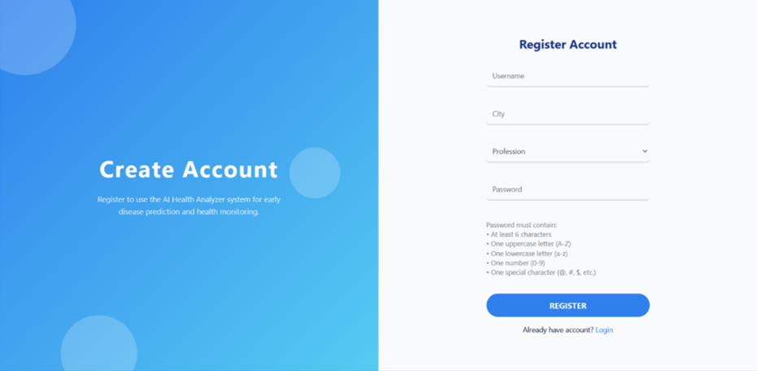
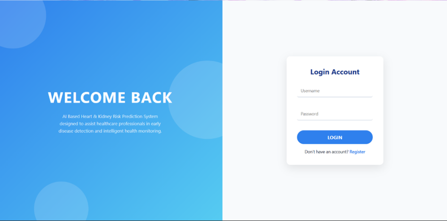
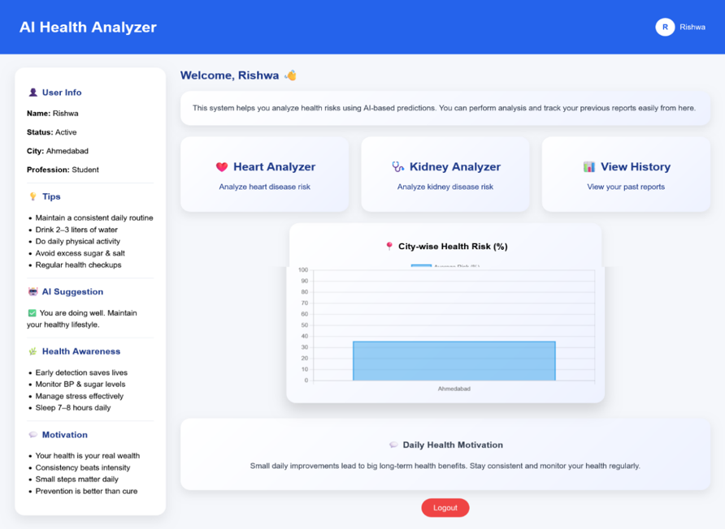
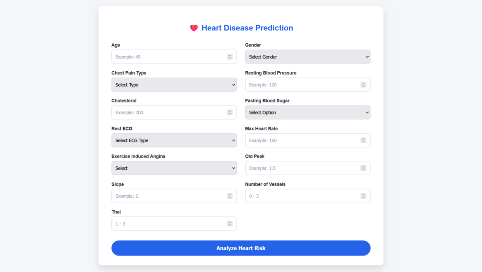
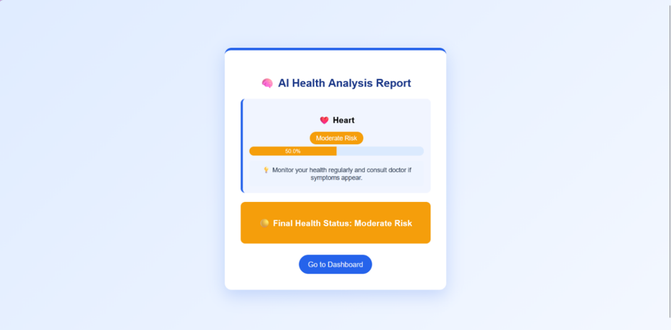
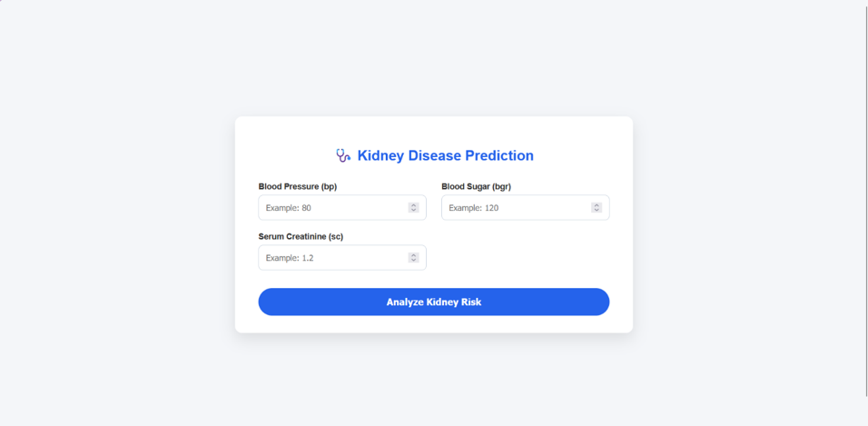
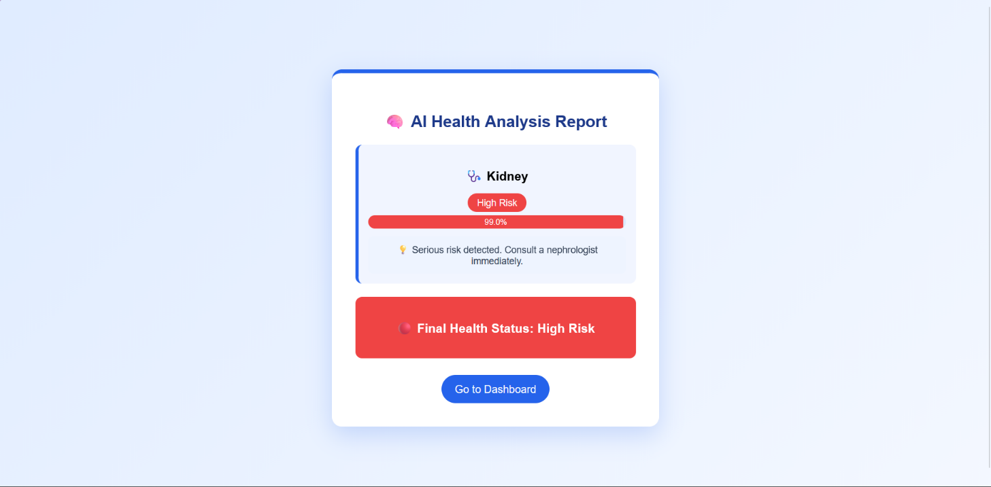
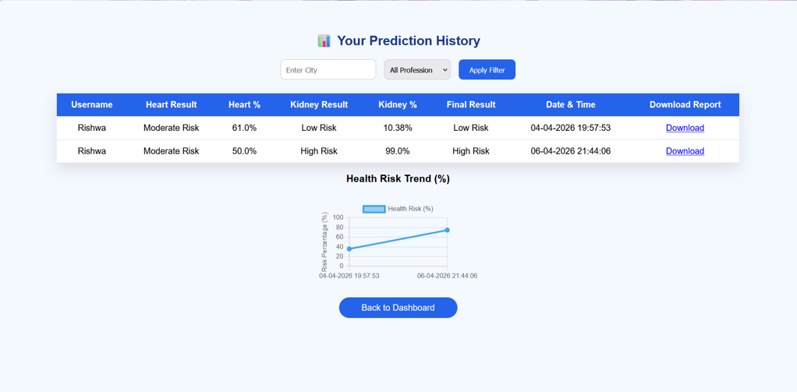
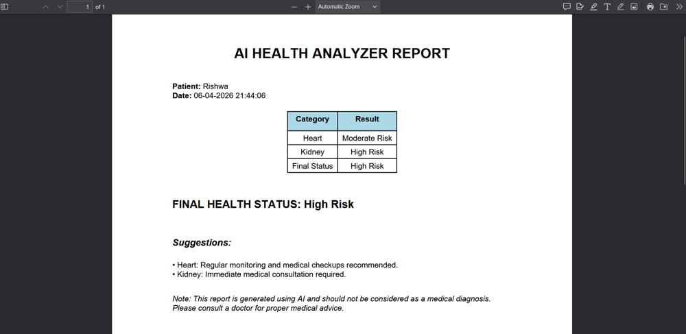

# 🩺 AI-Based Heart and Kidney Analyzer

An AI-powered healthcare web application that predicts the risk of **Heart Disease** and **Kidney Disease** using Machine Learning. The system analyzes medical parameters, calculates a percentage-based risk score, classifies the risk level, and provides personalized health recommendations to promote early disease awareness.

---

# 📌 Project Overview

The **AI-Based Heart and Kidney Analyzer** is a Flask-based healthcare application developed to assist users in the early prediction of heart and kidney diseases using Machine Learning.

The system analyzes important medical parameters such as:

- Age
- Blood Pressure
- Cholesterol
- Blood Sugar
- ECG Results
- Maximum Heart Rate
- Exercise Induced Angina
- Serum Creatinine
- Hemoglobin
- Other clinical parameters

Using a **Random Forest Machine Learning model**, the application predicts disease risk and displays:

- 📊 Risk Percentage
- 🟢 Low / 🟡 Moderate / 🔴 High Risk Level
- 💡 Personalized Health Suggestions

The system also stores prediction history, generates downloadable PDF health reports, and enables users to monitor their health records efficiently.

---

# 🎯 Objectives

- Predict Heart Disease Risk
- Predict Kidney Disease Risk
- Generate Percentage-Based Risk Predictions
- Provide Personalized Health Suggestions
- Maintain User Prediction History
- Generate Downloadable Health Reports
- Increase Health Awareness through Artificial Intelligence

---

# ✨ Features

- 👤 User Registration
- 🔐 Secure User Login
- 🏠 Interactive Dashboard
- ❤️ Heart Disease Analyzer
- 🩺 Kidney Disease Analyzer
- 📈 Percentage-Based Risk Prediction
- 🚦 Risk Classification (Low, Moderate, High)
- 💡 Personalized Health Suggestions
- 📜 Prediction History
- 📄 Downloadable PDF Health Report
- 🗄 SQLite Database Integration
- 🤖 Machine Learning-Based Prediction
- 🎨 Responsive and User-Friendly Interface

---

# 🚀 Project Modules

## 👤 User Authentication

- User Registration
- Secure Login
- Session Management

## 🏠 Dashboard

- Central navigation page
- Access to Heart Analyzer
- Access to Kidney Analyzer
- View Prediction History
- Generate Health Reports

## ❤️ Heart Disease Analyzer

- Medical Parameter Input Form
- Disease Risk Prediction
- Percentage-Based Analysis
- Health Recommendations

## 🩺 Kidney Disease Analyzer

- Medical Parameter Input Form
- Disease Risk Prediction
- Percentage-Based Analysis
- Health Recommendations

## 📜 Prediction History

- Stores previous predictions
- Displays prediction records
- Helps users monitor health over time

## 📄 Health Report

- Downloadable PDF Report
- Contains prediction details
- Includes risk level and health suggestions

---

# 🛠 Technologies Used

## Frontend

- HTML
- CSS
- JavaScript

## Backend

- Python
- Flask

## Machine Learning

- Scikit-learn
- Random Forest Classifier

## Database

- SQLite

## Development Tools

- PyCharm
- Git
- GitHub

---

# 🧠 Machine Learning Model

The application uses the **Random Forest Classifier**, which is trained on healthcare datasets to predict disease risk.

The model:

- Accepts medical parameters
- Calculates disease probability
- Converts probability into percentage
- Categorizes prediction into:
  - 🟢 Low Risk
  - 🟡 Moderate Risk
  - 🔴 High Risk
- Generates personalized health suggestions

---

# 📂 Project Structure

```text
AI-Based-Heart-and-Kidney-Analyzer/
│
├── static/
├── templates/
├── screenshots/
├── models/
├── reports/
├── app.py
├── database.db
├── requirements.txt
├── README.md
└── .gitignore
```

---

# 🚀 Installation

## Clone the Repository

```bash
git clone https://github.com/rishwapatel16/AI-Based-Heart-and-Kidney-Analyzer.git
```

## Navigate to the Project Folder

```bash
cd AI-Based-Heart-and-Kidney-Analyzer
```

## Install Dependencies

```bash
pip install -r requirements.txt
```

## Run the Application

```bash
python app.py
```

Open your browser and visit:

```
http://127.0.0.1:5000
```

---

# 📊 System Workflow

1. User registers a new account.
2. User logs into the application.
3. Dashboard is displayed.
4. User selects either:
   - Heart Disease Analyzer
   - Kidney Disease Analyzer
5. User enters medical parameters.
6. Flask sends the data to the trained Random Forest model.
7. The model predicts disease probability.
8. Risk percentage is calculated.
9. Risk level is classified as:
   - 🟢 Low
   - 🟡 Moderate
   - 🔴 High
10. Personalized health suggestions are displayed.
11. Prediction details are stored in SQLite.
12. User can view Prediction History.
13. User can generate and download a PDF Health Report.

---

# 📷 Application Screenshots

## 👤 Registration Page



---

## 🔐 Login Page



---

## 🏠 Dashboard



---

## ❤️ Heart Analyzer Form



---

## 📊 Heart Disease Risk Analysis



---

## 🩺 Kidney Analyzer Form



---

## 📊 Kidney Disease Risk Analysis



---

## 📜 Prediction History



---

## 📄 Health Report



---

# ⚠️ Limitations

- Prediction depends on the quality of the input data.
- Uses only selected medical parameters.
- Limited to Heart and Kidney disease prediction.
- Does not replace professional medical diagnosis.
- No real-time doctor consultation.
- Accuracy depends on the trained dataset.

---

# 🚀 Future Enhancements

- Support prediction for additional diseases.
- AI-powered health chatbot.
- Doctor consultation module.
- Email and SMS health alerts.
- Mobile application.
- Cloud database integration.
- Integration with wearable health devices.
- Multi-language support.
- Real-time health monitoring.
- Appointment booking system.

---
# 🛠️ Tech Stack 


# 👨‍💻 Developer

**Rishwa Patel**

Bachelor of Engineering (Information Technology)

Vishwakarma Government Engineering College (VGEC), Chandkheda

Ahmedabad, Gujarat, India

---

# 📄 License

This project is developed for **educational, academic, and internship purposes**.
